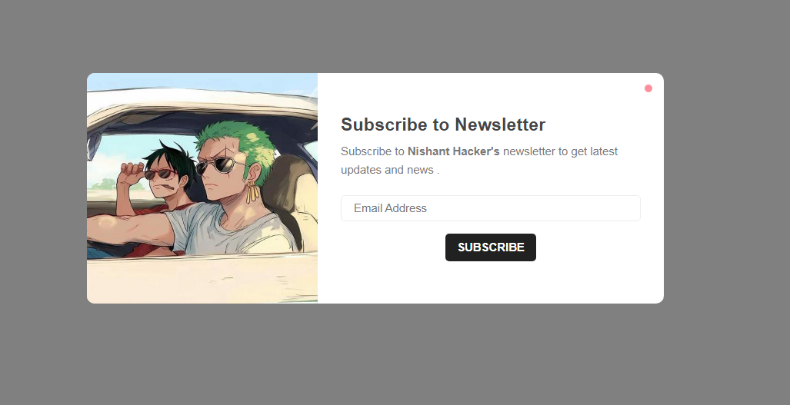
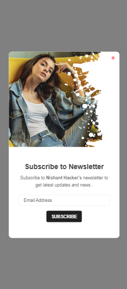

## Demo




## Prerequisites

Before you begin, ensure you have met the following requirements:

* [Git](https://git-scm.com/downloads "Download Git") must be installed on your operating system.

## Installing Newsletter  POP window

To install **Newsletter  POP window**, follow these steps:

Linux and macOS:

```bash
sudo git clone https://github.com/Nishant-Hacker/newsletter-popup.git
```

Windows:

```bash
git clone https://github.com/Nishant-Hacker/newsletter-popup.git
```


## License

This project is **free to use** and does not contains any license.
